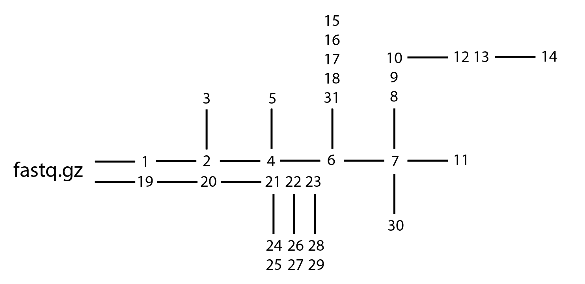

# Pipeline
```
#$1 - sample name
#$2 - threads


#1. Quality contol of raw reads
fastqc -t $2 $1_1.fastq.gz $1_2.fastq.gz


#2. Filtration by trimmomatic:
java -jar /opt/Trimmomatic-0.39/trimmomatic-0.39.jar \
PE \
-threads $2 \
-phred33 \
$1_1.fastq.gz $1_2.fastq.gz \
$1_R1_paired.fastq.gz $1_R1_unpaired.fastq.gz \
$1_R2_paired.fastq.gz $1_R2_unpaired.fastq.gz \
ILLUMINACLIP:/opt/Trimmomatic-0.39/adapters/All_adapters.fa:2:30:10 \
LEADING:0 TRAILING:0 SLIDINGWINDOW:4:0 HEADCROP:0


#3. Quality contol of filtered reads
fastqc -t 2 $1_R1_paired.fastq.gz $1_R2_paired.fastq.gz


#4. Assembly by SPAdes
 /opt/SPAdes-3.15.4-Linux/bin/metaspades.py \
-o ./Spades_assembly/$1 \
-1 ./$1_R1_paired.fastq.gz \
-2 ./$1_R2_paired.fastq.gz \
-s ./$1_R1_unpaired.fastq.gz \
-m 1005 -t $2 -k 33,55,99


#5. Quast
/opt/quast/quast.py \
-t $2 \
-m 500 \
-l ./Spades_assembly/$1/contigs.fasta \
-o ./quast_results/$1 \
./Spades_assembly/$1/contigs.fasta

/opt/quast/quast.py \
-t $2 \
-m 5000 \
-l ./Spades_assembly/$1/contigs.fasta_5kb \
-o ./quast_results/$1_5kb \
./Spades_assembly/$1/contigs.fasta


#6. Filtration contigs by length >= 5kb
python3 Select_contigs_by_length.py \
--inputfile ./Spades_assembly/$1/contigs.fasta \
--outputdir ./Assembly_short_name_5000bp/ \
--outputfile $1.fasta


#7. Run prokka
prokka \
--cpus $2 \
--gcode 11 \
--metagenome \
--force \
--outdir ./Annotation_prokka/$1 \
--prefix $1 \
./Assembly_short_name_5000bp/$1.fasta


#8. Run Antismash
/opt/antismash/run_antismash \
./Annotation_prokka/$1/$1.gbk \
./Antismash/ \
-c $2 \
-v \
--clusterhmmer \
--tigrfam \
--cb-general \
--cb-subclusters \
--cb-knownclusters \
--cc-mibig \
--output-basename $1 \
--genefinding-tool prodigal \
--html-title $1


#9. Run Bigscape
/opt/BiG-SCAPE/run_bigscape \
./Antismash/$1 \
./Bigscape/$1 \
-c $2 \
-v


#10. Run metagenemark
/opt/MetaGeneMark-2/src/gmhmmp2 \
-s ./Assembly_short_name_5000bp/$1.fasta \
-f gff3 \
-M /opt/MetaGeneMark-2/src/mgm2_11.mod \
--gid_per_contig \
--verbose \
--out ./Annotation_mgm/$1.gff3 \
--AA ./Annotation_mgm/$1.fasta


#11. Run Cas_effectors and Cas_proteins
mkdir ./Cas_effectors/$1
mkdir ./Cas_proteins

hmmsearch \
--tblout ./Cas_effectors/$1/$1_Cas9.txt \
-E 10e-3 \
--cpu $2 \
./Cas_profiles/TIGR01865.1.HMM \
./Annotation_prokka/$1/$1.faa

hmmsearch \
--tblout ./Cas_effectors/$1/$1_Cas12.txt \
-E 10e-3 \
--cpu $2 \
./Cas_profiles/TIGR04330.1.HMM \
./Annotation_prokka/$1/$1.faa

python3 Read_hmmsearch_output_return_sequences.py \
-s ./Annotation_prokka/$1/$1.faa \
-m .k/Cas_effectors/$1/$1_Cas9.txt \
-e 0.001 \
-o ./Cas_proteins/$1_Cas9.fasta

python3 Read_hmmsearch_output_return_sequences.py \
-s ./Annotation_prokka/$1/$1.faa \
-m ./Cas_effectors/$1/$1_Cas12.txt \
-e 0.001 \
-o .k/Cas_proteins/$1_Cas12.fasta


#12. Run defensefinder
mkdir ./Defensefinder/$1

defense-finder run \
-w $2 \
--db-type gembase \
-o ./Defensefinder/$1 \
/Annotation_mgm/$1.fasta


#13.  Run Padloc
mkdir ./Annotation_prokka_for_padloc/$1

sed '/^##FASTA/Q' ./Annotation_prokka/$1/$1.gff > ./Annotation_prokka_for_padloc/$1/$1_noseq.gff

mkdir /home/lam2/Maxim_work/Padloc/$1

padloc \
--cpu $2 \
--faa ./Annotation_prokka/$1/$1.faa \
--gff ./Annotation_prokka_for_padloc/$1/$1_noseq.gff \
--outdir ./Padloc/$1

mkdir ./Padloc_mgm/

mkdir ./Padloc_mgm/$1

padloc \
--cpu $2 \
--faa ./Annotation_mgm/$1.fasta \
--gff ./Annotation_mgm/$1.gff3 \
--outdir ./Padloc_mgm/$1


#14. Run vizualization for results defensefinder and padloc

python3 antismash_viz.py \
-c $2 \
-v \
--output-dir ./Defensefinder_viz/$1 \
--output-basename $1 \
--html-title $1 \
--logfile $1 \
--APDS_pipeline defense-finder \
--genefinding-gff3 ./Annotation_mgm/$1.gff3 \
--APDS_data ./Defensefinder/$1/$1_defense_finder_genes.tsv \
--Prot_fasta ./Annotation_mgm/$1.fasta
./Assembly_short_name_5000bp/$1.fasta

mkdir ./Padloc_viz

mkdir ./Padloc_viz/$1

python3 antismash_viz.py \
-c $2 \
-v \
--output-dir ./Padloc_viz/$1 \
--output-basename $1 \
--html-title $1 \
--logfile $1 \
--APDS_pipeline padloc \
--genefinding-gff3 ./Annotation_prokka_for_padloc/$1/$1_noseq.gff \
--APDS_data ./Padloc/$1/$1_padloc.csv \
--Prot_fasta ./Annotation_prokka/$1/$1.faa \
./Assembly_short_name_5000bp/$1.fasta

mkdir ./Padloc_mgm_viz

mkdir ./Padloc_mgm_viz/$1

python3 antismash_viz.py \
-c $2 \
-v \
--output-dir ./Padloc_mgm_viz/$1 \
--output-basename $1 \
--html-title $1 \
--logfile $1 \
--APDS_pipeline padloc-mgm \
--genefinding-gff3 ./Annotation_mgm/$1.gff3 \
--APDS_data ./Padloc_mgm/$1/$1.fasta_padloc.csv \
--Prot_fasta ./Annotation_mgm/$1.fasta \
./Assembly_short_name_5000bp/$1.fasta


#15. Run checkv

checkv end_to_end \
-t $2 \
-d ./checkv-db-v0.6 \
--remove_tmp \
./Assembly_short_name_5000bp/$1.fasta \
/CheckV/$1


#16. Run ViralVerify

/opt/viralVerify/bin/viralverify \
-f ./Assembly_short_name_5000bp/$1.fasta \
-o ./ViralVerify/$1 \
-t $2 \
--hmm ./viralverify_hmms_db/nbc_hmms.hmm


#17. Run ViralComplete

/opt/viralComplete/bin/viralcomplete \
-f ./Assembly_short_name_5000bp/$1.fasta \
-o ./ViralComplete/$1 \
-t $2


#18. Run Virsorter

virsorter run \
-j $2 \
-d ./virsorter2-db \
-w ./Virsorter/$1 \
-i ./Assembly_short_name_5000bp/$1.fasta


#19. Run bwa-mem2

/opt/bwa-mem2-2.2.1_x64-linux/bwa-mem2 index \
./Spades_assembly/$1/contigs.fasta

/opt/bwa-mem2-2.2.1_x64-linux/bwa-mem2 mem \
-t $2 \
./Spades_assembly/$1/contigs.fasta \
$1_1.fastq.gz \
$1_2.fastq.gz | \
samtools sort -o ./bam/$1.bam -@ $2


#20 Index bam file

samtools index ./bam/$1.bam


#21 Binning by SemiBin

SemiBin2 single_easy_bin \
-i ./Spades_assembly/$1/contigs.fasta \
-b ./bam/$1.bam \
-o ./SemiBin/$1/


#22 Binning by metadecoder

mkdir ./metadecoder/$1

metadecoder seed \
--threads $2 \
-f ./Spades_assembly/$1/contigs.fasta \
-o ./metadecoder/$1/METADECODER.SEED

metadecoder coverage \
-b ./bam/$1.bam \
-o ./metadecoder/$1/METADECODER.COVERAGE

metadecoder cluster \
-f ./Spades_assembly/$1/contigs.fasta \
-c ./metadecoder/$1/METADECODER.COVERAGE \
-s ./metadecoder/$1/METADECODER.SEED \
-o ./metadecoder/$1/METADECODER


#23 Binning by comebin

/opt/comebin_env/bin/run_comebin.sh \
-a ./Spades_assembly/$1/contigs.fasta \
-p ./ -o ./comebin/$1/


#24 Checkm2 for bins from SemiBin. Result is here: ./SemiBin/$1/output_bins/CheckM/quality_report.tsv

gunzip ./SemiBin/$1/output_bins/*gz

checkm2 predict \
--input ./SemiBin/$1/output_bins/*.fa \
--output-directory ./$1_semibin/output_bins/CheckM \
--threads $2


#25 Annotation by GTDB (version 226, 2025) on bins from SemiBin. Result is here: ./SemiBin/$1/output_bins/gtdb/classify/gtdbtk.bac120.summary.tsv

gtdbtk classify_wf \
--genome_dir ./SemiBin/$1/output_bins/ \
--mash_db /opt/miniconda3/envs/gtdbtk241/share/gtdbtk-2.4.1/db/release226 \
--out_dir ./SemiBin/$1/output_bins/gtdb \
--cpus $2 \
--extension fa


#26 Checkm2 for bins from metadecoder. Result is here: ./metadecoder/$1/CheckM/quality_report.tsv

checkm2 predict \
--input ./metadecoder/$1/*.fasta \
--output-directory ./metadecoder/$1/CheckM \
--threads $2


#27 Annotation by GTDB (version 226, 2025) on bins from metadecoder (step 13). Result is here: ./metadecoder/$1/gtdb/classify/gtdbtk.bac120.summary.tsv

gtdbtk classify_wf --genome_dir ./$1_metadecoder/ \
--mash_db /opt/miniconda3/envs/gtdbtk241/share/gtdbtk-2.4.1/db/release226 \
--out_dir ./metadecoder/$1/gtdb \
--cpus $2 \
--extension fasta


#28 Checkm2 for bins from comebin. Result is here: ./comebin/$1/comebin_res/comebin_res_bins/CheckM/quality_report.tsv

checkm2 predict \
--input ./comebin/$1/comebin_res/comebin_res_bins/*.fa \
--output-directory ./comebin/$1/comebin_res/comebin_res_bins/CheckM \
--threads $2


#29 Annotation by GTDB (version 226, 2025) on bins from comebin. Result is here: ./comebin/$1/comebin_res/comebin_res_bins/gtdb/classify/gtdbtk.bac120.summary.tsv

gtdbtk classify_wf --genome_dir ./comebin/$1/comebin_res/comebin_res_bins/ \
--mash_db /opt/miniconda3/envs/gtdbtk241/share/gtdbtk-2.4.1/db/release226 \
--out_dir ./comebin/$1/comebin_res/comebin_res_bins/gtdb \
--cpus $2 \
--extension fa

#30 Run abricate

abricate --threads $2 --db ncbi ./Annotation_prokka/$1.gbk > ./abrucate/$1.tab
